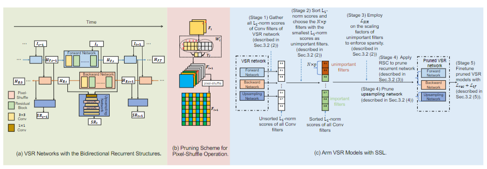
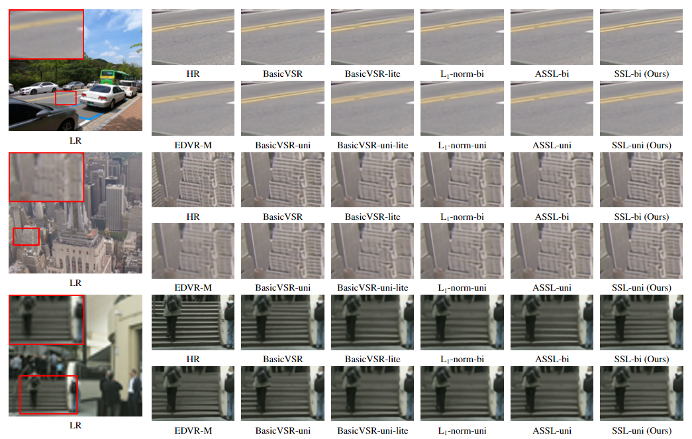

# Structured Sparsity Learning for Efficient Video Super-Resolution (CVPR2023)

[Paper](https://arxiv.org/pdf/2206.07687.pdf)] | [Project](https://github.com/Zj-BinXia/SSL) | [pretrained models](https://drive.google.com/drive/folders/1of6pPD1exn_VWnekIW-gmaY7jHLOlZvm)


<p align="center">
  
</p>

---

##  Dependencies and Installation

- Python == 3.8 (Recommend to use [Anaconda](https://www.anaconda.com/download/#linux) or [Miniconda](https://docs.conda.io/en/latest/miniconda.html))
- [PyTorch == 1.10](https://pytorch.org/)
- basicsr == 1.3.5


## Dataset Preparation

We train our network with REDS and Vimeo90K datasets (please see [BasicSR](https://github.com/XPixelGroup/BasicSR/blob/master/docs/DatasetPreparation.md))

---

## Training

Train x4 VSR bicubic on REDS 

```bash

CUDA_VISIBLE_DEVICES=0,1,2,3,4,5,6,7 bash ./scripts/dist_train.sh 8 options/train/BasicVSR/train_BasicVSR_REDS_l1.yml
```

Train x4 VSR bicubic on Vimeo90K 

```bash

CUDA_VISIBLE_DEVICES=0,1,2,3,4,5,6,7 bash ./scripts/dist_train.sh 8 options/train/BasicVSR/train_BasicVSR_Vimeo90K_BIx4.yml
```

Train x4 VSR BD on Vimeo90K 

```bash

CUDA_VISIBLE_DEVICES=0,1,2,3,4,5,6,7 bash ./scripts/dist_train.sh 8 options/train/BasicVSR/train_BasicVSR_Vimeo90K_BDx4.yml
```


---

## :european_castle: Model Zoo

Please download checkpoints from [Google Drive](https://drive.google.com/drive/folders/1of6pPD1exn_VWnekIW-gmaY7jHLOlZvm).

---
## Testing
```bash
#####Testing VSR bicubic ########

sh test_reds_BI.sh

sh test_vid4_BI.sh

sh test_Vimeo_BI.sh

#####Testing VSR BD ########

sh sh test_udm10_BD.sh

sh sh test_Vimeo_BD.sh

sh sh test_vid4_BD.sh
```
---
## Results
<p align="center">
  
</p>


---


## 📧 Contact

If you have any question, please email `zjbinxia@gmail.com`.
